<!-- ---
title: Configuração do GoldenGate for Big Data - Azure Data Lake
author: Lucas Pimentel Lellis
lang: pt-BR
--- -->

# Requisitos e Ambiente Utilizado

## Software
* Oracle Linux 6
* Base Oracle 11.2.0.4 (ou superior) em Archivelog
* Conta na Azure (pode ser free trial)
* GoldenGate 19c
* GoldenGate for Big Data 19c
* OpenJDK 8
* Hadoop 3.2.1
* Opcional - [Swingbench 2.6+](http://www.dominicgiles.com/swingbench.html) (ou outro simulador de carga)
* Opcional - Acesso via Interface Gráfica para o SwingBench - Xming ou VNC

## Profile sugerido

```bash
ORACLE_BASE="/u01/app/oracle"
ORACLE_HOME="${ORACLE_BASE}/product/11.2.0/db_1"
PATH="${ORACLE_HOME}/bin:$PATH"
LD_LIBRARY_PATH="${ORACLE_HOME}/lib:$LD_LIBRARY_PATH"
NLS_LANG="AMERICAN_AMERICA.AL32UTF8"
NLS_DATE_FORMAT="DD/MM/YYYY HH24:MI:SS"
ORACLE_PATH="/home/oracle/sqlplus"
ORACLE_SID=orcl001

export ORACLE_BASE ORACLE_HOME PATH LD_LIBRARY_PATH NLS_LANG NLS_DATE_FORMAT ORACLE_PATH
export ORACLE_SID

export PS1='[\u@\h $ORACLE_SID \W]\$ '

HADOOP_HOME="/u05/goldengate/hadoop/hadoop-3.2.1"
JAVA_HOME="/etc/alternatives/java_sdk_openjdk"
JRE_HOME="$JAVA_HOME/jre"
PATH=$JAVA_HOME/bin:$HADOOP_HOME/bin:$PATH
LD_LIBRARY_PATH=$HADOOP_HOME/lib:$JRE_HOME/lib/amd64/server:$JAVA_HOME/lib:$LD_LIBRARY_PATH

export JAVA_HOME JRE_HOME PATH LD_LIBRARY_PATH
```

# Configurar acesso ao Azure Data Lake Gen 2 na Azure

## Logar no [Portal da Azure](https://portal.azure.com)

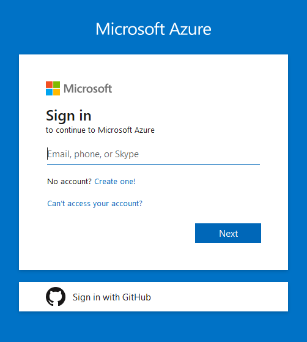

## No menu superior à esquerda, navegar até Storage Accounts

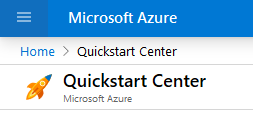

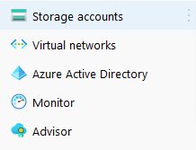

## Clicar em "Create Storage Account"


## Definir o Resource Group, nome da Storage Account e clicar em "Next: Networking"

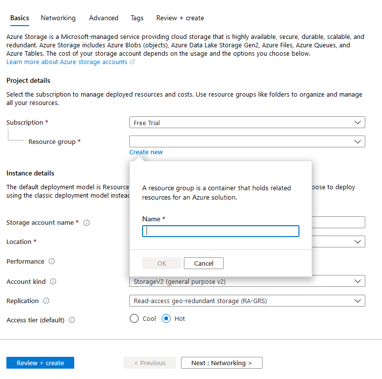

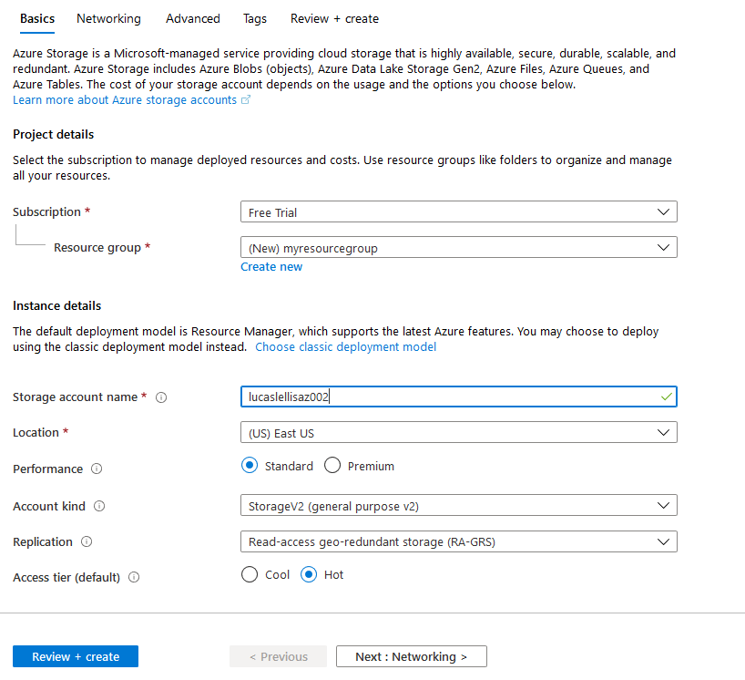

## Clicar em Enabled para a opção Hierarchical Namespace e em seguida clicar em "Next: Tags"

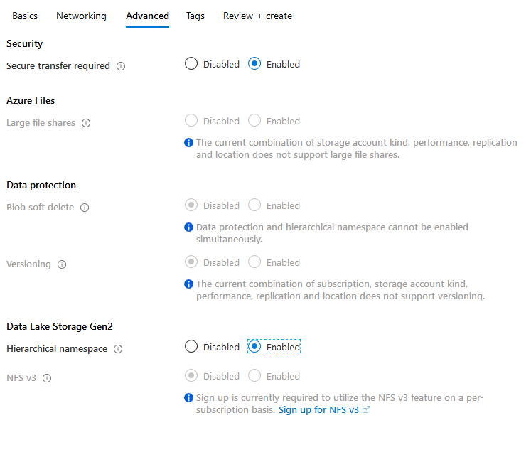

## Clicar em "Review + create"

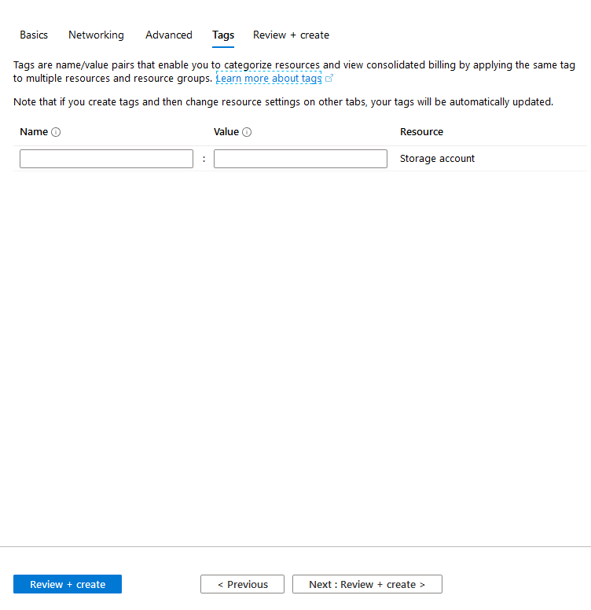

## Clicar em Create

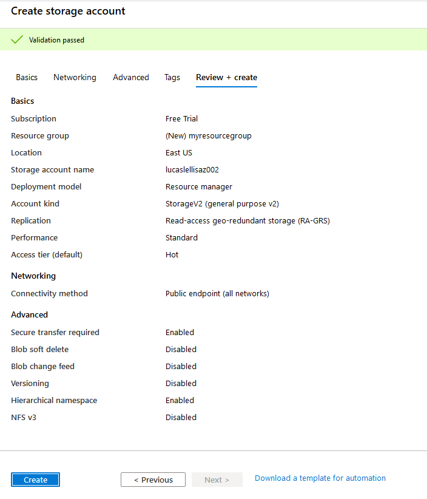

## Aguardar criação da Storage Account

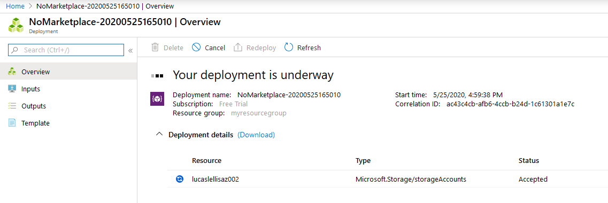

## Clicar em "Go to resource"

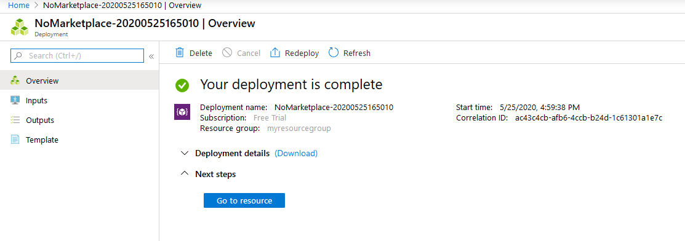

## No menu à esquerda, ir em Containers (na seção Data Lake Storage)

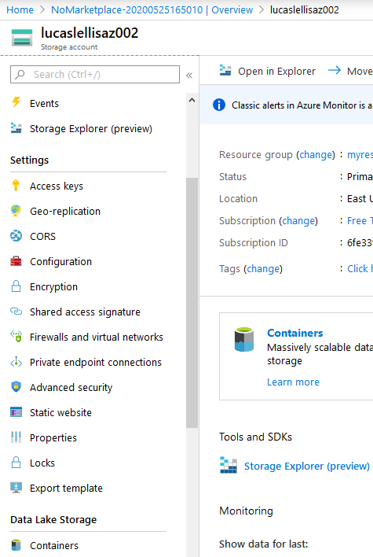

## Clicar em "+ Container"

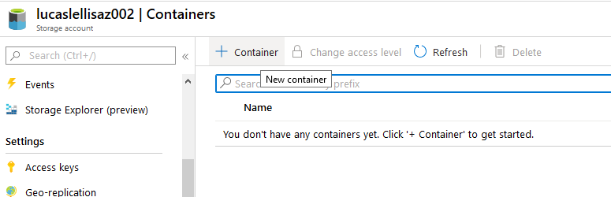

## No menu aberto à direita, definir o nome e clicar em "Create"

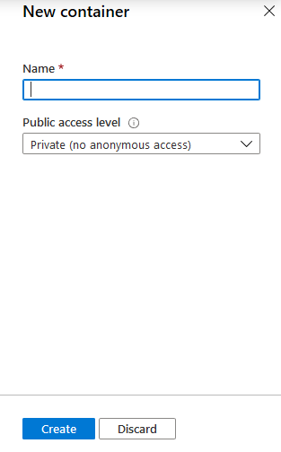

## Voltar à Home do Portal e buscar por "app registrations"

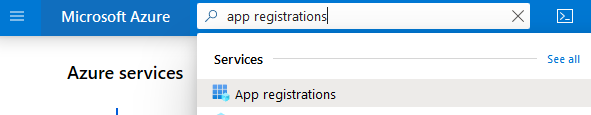

## Clicar em New registration

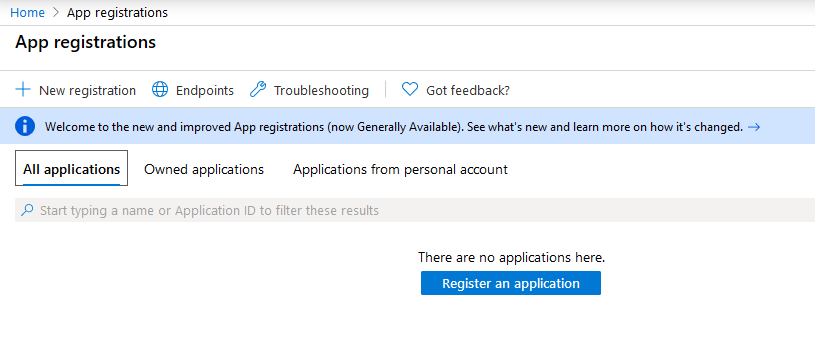

## Definir o nome e clicar em "Register"

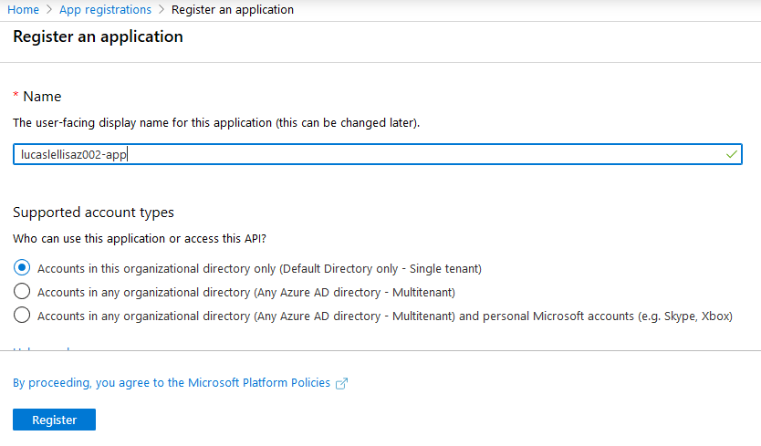

## Na página da App Registration, tomar nota dos valores para os seguintes itens
* Application (client) ID
* Directory (tenant) ID
* Object ID

Esses dados serão utilizados para a configuração do Hadoop client.

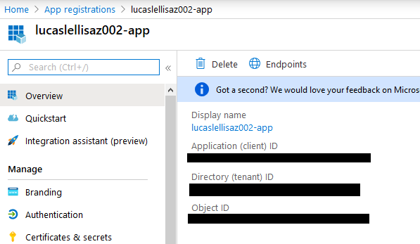

## No menu à esquerda, clicar em "Certificates & Secrets"


## Clicar em "New Client Secret"

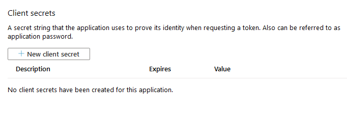

## Definir a descrição, selecionar a opção "never" em Expires e clicar em Add

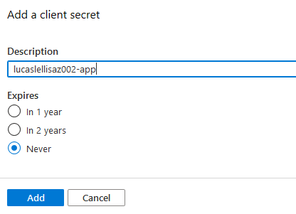

## Tomar nota do campo Value do client secret criado

Esse valor não pode ser obtido novamente e será usado na configuração do Hadoop client

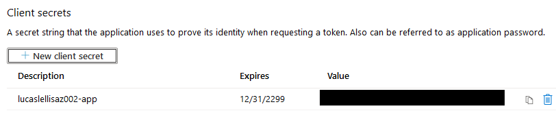

## Voltar no container criado e clicar em "Access Control (IAM)"

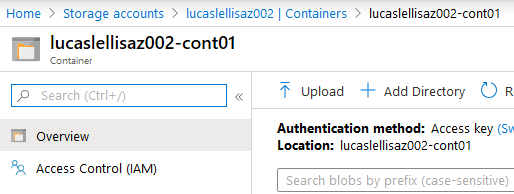

## Clicar em "Add Role Assignment"

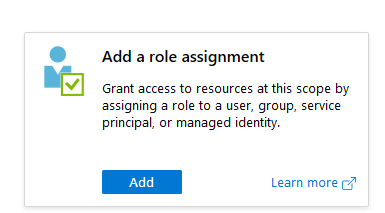

## Atribuir a Role "Storage Blob Data Contributor" e em "Select" escolher o App criado no item [2.16](#na-página-da-app-registration-tomar-nota-dos-valores-para-os-seguintes-itens)

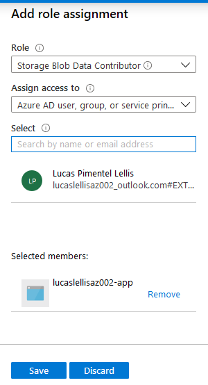

Clicar em Save para finalizar.

# Criação do Schema SOE do SwingBench

## Criar tablespace

```sql
create bigfile tablespace ts_soe datafile size 1g autoextend on next 100m;
```

## Instalar o SwingBench

Basta descompactar o arquivo swingbenchlatest.zip

## Abrir o oewizard do SwingBench

```bash
cd swingbench/bin
./oewizard
```

## Seguir os passos abaixo para criação do schema

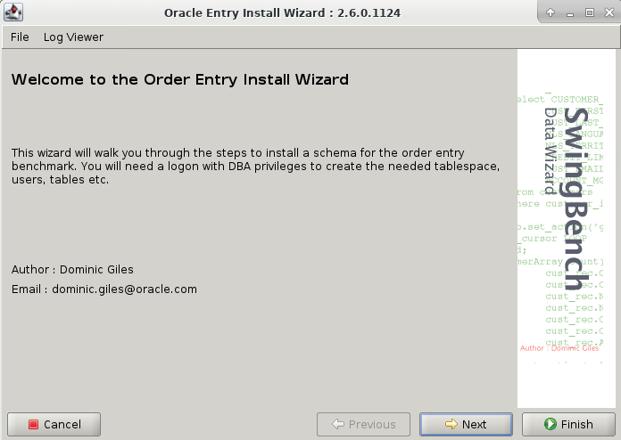

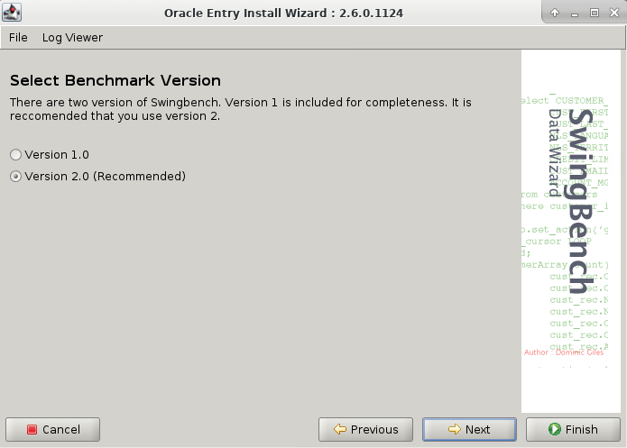


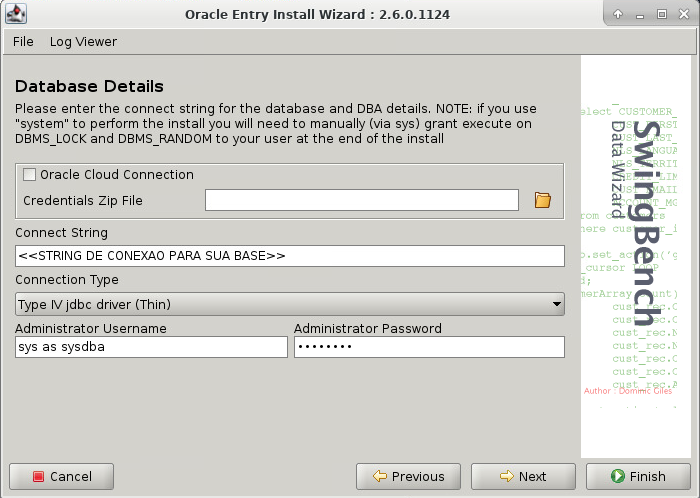

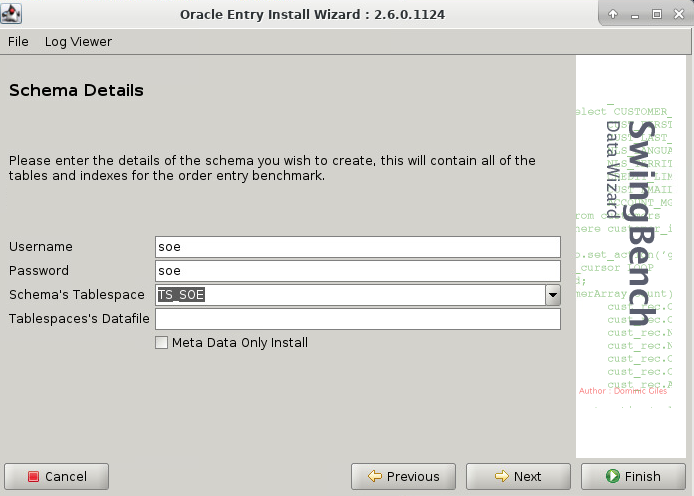

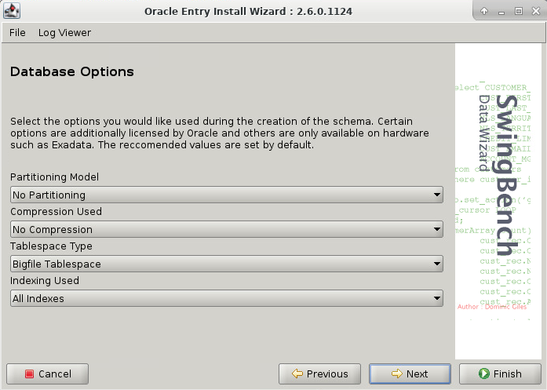

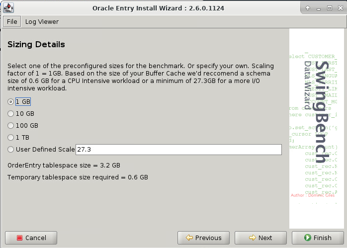

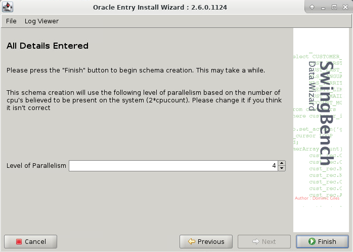

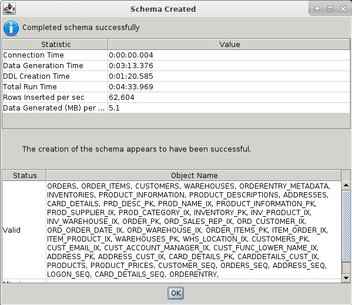

## Validar as PKs das tabelas do schema SOE

```sql
begin
    for c_tab in (select table_name, constraint_name
                  from dba_constraints
                  where owner = 'SOE'
                  and constraint_type = 'P')
    loop
        execute immediate 'alter table SOE.'||c_tab.table_name||' modify constraint '||c_tab.constraint_name||' enable validate';
    end loop;
end;
/

select distinct status, validated
from dba_constraints
where owner = 'SOE'
and constraint_type = 'P';
```

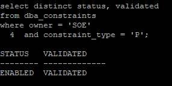

# Instalação do GoldenGate for Oracle

## Descompactar instalador

```bash
mkdir /tmp/gginstall
unzip -q -d /tmp/gginstall 191004_fbo_ggs_Linux_x64_shiphome.zip
cd /tmp/gginstall/fbo_ggs_Linux_x64_shiphome/Disk1
```

## Criar response file

```bash
cat > gginst.rsp <<ENDEND
oracle.install.responseFileVersion=/oracle/install/rspfmt_ogginstall_response_schema_v19_1_0
INSTALL_OPTION=ORA11g
SOFTWARE_LOCATION=/u05/goldengate/ogg_1
START_MANAGER=false
DATABASE_LOCATION=/u01/app/oracle/product/11.2.0/db_1
INVENTORY_LOCATION=/u01/app/oraInventory
UNIX_GROUP_NAME=oinstall
ENDEND
```

## Executar instalador

```bash
./runInstaller -silent -responseFile `pwd`/gginst.rsp -showProgress
```

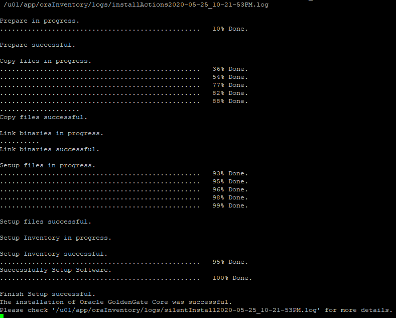


# Instalação do GoldenGate for Big Data

```bash
mkdir /tmp/gg_bd
unzip -d /tmp/gg_bd OGG_BigData_Linux_x64_19.1.0.0.1.zip

cd /tmp/gg_bd
mkdir /u05/goldengate/oggbigdata_1
tar -C /u05/goldengate/oggbigdata_1 -xf OGG_BigData_Linux_x64_19.1.0.0.1.tar
```

# Instalação do hadoop

```bash
mkdir /u05/goldengate/hadoop
tar -C /u05/goldengate/hadoop -xzvf hadoop-3.2.1.tar.gz
```

# Configuração do Hadoop

```bash
cd /u05/goldengate/hadoop/hadoop-3.2.1

vi etc/hadoop/hadoop-env.sh
```

* No arquivo _hadoop-env.sh_, inserir as informações abaixo:

  ```bash
  export JAVA_HOME=<<CAMINHO PARA O JAVA SDK>>
  export HADOOP_OPTIONAL_TOOLS="hadoop-azure"
  ```

* Exemplo:

  ```bash
  export JAVA_HOME=/etc/alternatives/java_sdk_openjdk
  export HADOOP_OPTIONAL_TOOLS="hadoop-azure"
  ```

* Fechar o vi

  ```bash
  vi etc/hadoop/core-site.xml
  ```

* No arquivo _etc/hadoop/core-site.xml_, inserir as informações requeridas abaixo (entre ## e ##), de acordo com os itens [2.16](#na-página-da-app-registration-tomar-nota-dos-valores-para-os-seguintes-itens) e [2.20](#tomar-nota-do-campo-value-do-client-secret-criado):

  ```xml
  <configuration>
    <property>
      <name>fs.azure.account.auth.type</name>
      <value>OAuth</value>
    </property>
    <property>
      <name>fs.azure.account.oauth.provider.type</name>
      <value>org.apache.hadoop.fs.azurebfs.oauth2.ClientCredsTokenProvider</value>
    </property>
    <property>
      <name>fs.azure.account.oauth2.client.endpoint</name>
      <value>https://login.microsoftonline.com/##Directory (tenant) ID - instance id##/oauth2/token</value>
    </property>
    <property>
      <name>fs.azure.account.oauth2.client.id</name>
      <value>##Application (client) ID##</value>
    </property>
    <property>
      <name>fs.azure.account.oauth2.client.secret</name>
      <value>## client secret ##</value>
    </property>
    <property>
      <name>fs.defaultFS</name>
      <value>abfss://##NOME DO CONTAINER##@##NOME DA CONTA##.dfs.core.windows.net</value>
    </property>
    <property>
      <name>fs.azure.createRemoteFileSystemDuringInitialization</name>
      <value>true</value>
    </property>
  </configuration>
  ```

* Exemplo:

  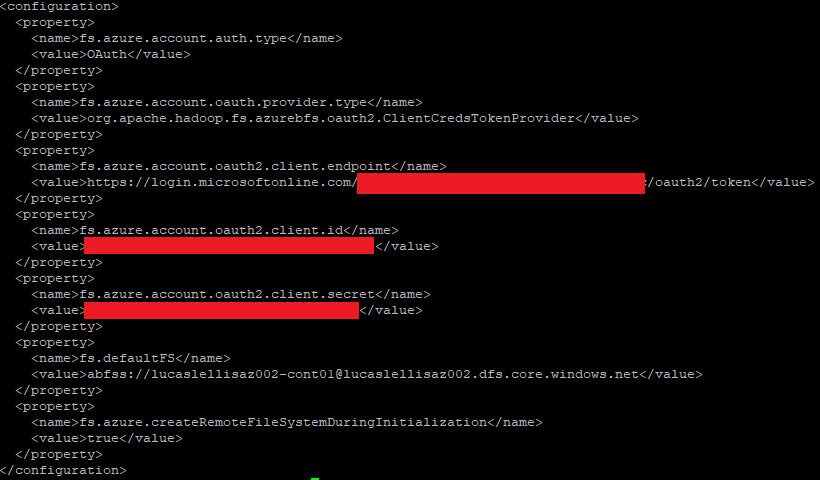

* Fechar o vi

* Validar configuração

  ```bash
  ./bin/hadoop fs -ls /
  ./bin/hadoop fs -mkdir /tmp
  ./bin/hadoop fs -ls /
  ./bin/hadoop fs -rmdir /tmp
  ```

  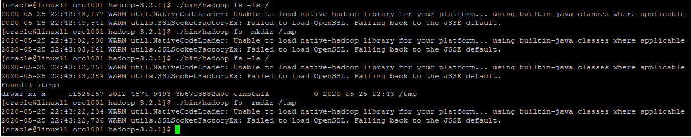

# Configurar manager do GoldenGate para Oracle

```bash
cd /u05/goldengate/ogg_1
./ggsci

ggsci> create subdirs
ggsci> edit params mgr
```

* No arquivo aberto pelo vi, inserir as informações abaixo:

  ```
  PORT 7809
  DYNAMICPORTLIST 7810-7820, 7830
  PURGEOLDEXTRACTS ./dirdat/et* , USECHECKPOINTS
  AUTORESTART ER *, RETRIES 3, WAITMINUTES 10, RESETMINUTES 60
  STARTUPVALIDATIONDELAY 5
  DOWNREPORTMINUTES 15
  LAGCRITICALSECONDS 10
  LAGINFOMINUTES 0
  LAGREPORTMINUTES 15
  ACCESSRULE, PROG COLLECTOR, IPADDR 127.0.0.1, ALLOW
  ACCESSRULE, PROG COLLECTOR, IPADDR <<IP DA SUA MÁQUINA>>, ALLOW
  ACCESSRULE, PROG *, IPADDR 127.0.0.1, ALLOW
  ACCESSRULE, PROG *, IPADDR <<IP DA SUA MÁQUINA>>, ALLOW
  ACCESSRULE, PROG *, IPADDR *, DENY
  ```

* Fechar o vi

* Iniciar o manager

  ```
  ggsci> start mgr
  ggsci> info mgr
  ```

# Configurar manager do GoldenGate para Big Data

```bash
cd /u05/goldengate/oggbigdata_1
export OGG_HOME=/u05/goldengate/oggbigdata_1
./ggsci
ggsci> create subdirs
ggsci> edit params mgr
```

* no arquivo aberto pelo vi, inserir as informações abaixo:

  ```
  PORT 27809
  DYNAMICPORTLIST 7810-7820, 7830
  PURGEOLDEXTRACTS ./dirdat/rt* , USECHECKPOINTS
  AUTORESTART ER *, RETRIES 3, WAITMINUTES 10, RESETMINUTES 60
  STARTUPVALIDATIONDELAY 5
  ACCESSRULE, PROG COLLECTOR, IPADDR 127.0.0.1, ALLOW
  ACCESSRULE, PROG COLLECTOR, IPADDR <<IP DA SUA MÁQUINA>>, ALLOW
  ACCESSRULE, PROG *, IPADDR 127.0.0.1, ALLOW
  ACCESSRULE, PROG *, IPADDR <<IP DA SUA MÁQUINA>>, ALLOW
  ACCESSRULE, PROG *, IPADDR *, DENY
  ```

* fechar o vi

  ```
  ggsci> start mgr
  ggsci> info mgr
  ```

# Configurar parâmetros da base de origem

```sql
SQL> alter system set ENABLE_GOLDENGATE_REPLICATION=true;
```

* Configurar shared_pool_size (1,25GB para cada extract)

* Adição de supplemental log e habilitar force logging

  ```sql
  SQL> ALTER DATABASE ADD SUPPLEMENTAL LOG DATA;
  SQL> ALTER DATABASE FORCE LOGGING;
  ```

* Verificar que foram ativados com sucesso

  ```sql
  SELECT supplemental_log_data_min, force_logging FROM v$database;
  ```

* Executar um switch dos logfiles

  ```sql
  SQL> ALTER SYSTEM SWITCH LOGFILE;
  ```

# Criação do usuário do GoldenGate na Origem

```sql
create tablespace ts_ggadmin datafile size 100m autoextend on next 100m;

create user ggadmin identified by <<SENHA>> default tablespace ts_ggadmin
    quota unlimited on ts_ggadmin;

grant create session to ggadmin;
grant resource to ggadmin;
grant dba to ggadmin;
grant flashback any table to ggadmin;
exec dbms_goldengate_auth.grant_admin_privilege('GGADMIN');
```

# Criação da credencial no goldengate

```bash
cd /u05/goldengate/ogg_1
./ggsci
```

* Verificar se já não há credential store

  ```
  ggsci> info credentialstore
  ```

* Caso não haja, criar

  ```
  ggsci> add credentialstore
  ```

* Adicionar credencial

  ```
  ggsci> alter credentialstore add user ggadmin password <<SENHA>> alias orcl001_ggadmin
  ```

# Adição de supplemental logging no nível de schema ou tabela

```
ggsci> dblogin useridalias orcl001_ggadmin

ggsci> add schematrandata <nome do SCHEMA>
```

ou

```
ggsci> add trandata <SCHEMA>.<TABELA>
```

* Para a configuração que será feita:

  ```
  ggsci> add trandata SOE.ORDERS
  ```

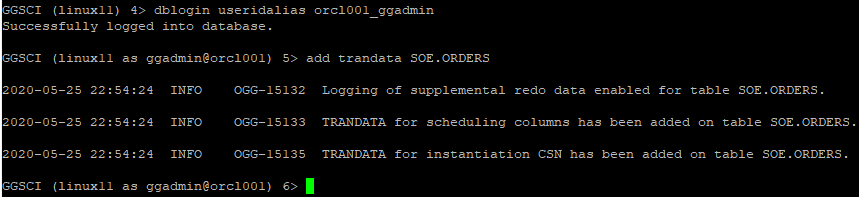

# Ajustar undo_retention

```sql
-- Recomendado para no mínimo um dia
alter system set undo_retention=86400;
```

```
Calculate the space that is required in the undo tablespace by using the following
formula.
undo_space = UNDO_RETENTION * UPS + overhead
Where:
-- undo_space is the number of undo blocks.
-- UNDO_RETENTION is the value of the UNDO_RETENTION parameter (in seconds).
-- UPS is the number of undo blocks for each second.
-- overhead is the minimal overhead for metadata (transaction tables, etc.).
Use the system view V$UNDOSTAT to estimate UPS and overhead.
```

# Iniciar Swingbench

```bash
cd swingbench/bin
./swingbench
```

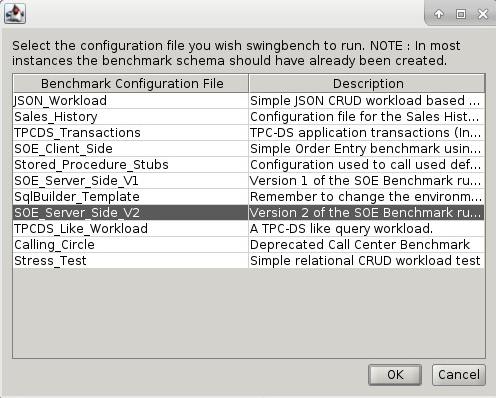

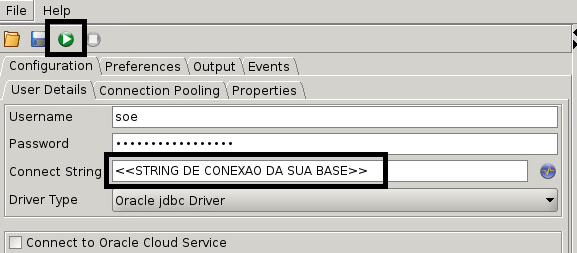

# Configuração do extract

```bash
cd /u05/goldengate/ogg_1
./ggsci
```

```
ggsci> dblogin useridalias orcl001_ggadmin
```

* Criar o arquivo do extract

  ```
  ggsci> edit params extsoe01
  ```

* No arquivo, informar os dados abaixo:

  ```
  EXTRACT extsoe01

  USERIDALIAS orcl001_ggadmin

  DISCARDFILE ./dirrpt/extsoe01.dsc, APPEND
  DISCARDROLLOVER AT 01:00 ON SUNDAY

  EXTTRAIL ./dirdat/et

  STATOPTIONS REPORTFETCH
  REPORTCOUNT every 10 minutes, RATE
  REPORTROLLOVER AT 01:00 ON SUNDAY

  TABLE SOE.ORDERS ;
  ```

* Fechar o vi

```
ggsci> ADD EXTRACT extsoe01, TRANLOG, BEGIN NOW
ggsci> ADD EXTTRAIL ./dirdat/et, EXTRACT extsoe01
```

```sql
-- executar um switch logfile no banco
SQL> alter system switch logfile;
```

# Garantir unicidade dos registros

* O GoldenGate requer um identificador único para as tabelas. Caso não haja, é necessário especificar o parâmetro keycols no extract da tabela.

# Instalação das dependências para o formato parquet

## instalar o maven

```bash
cd /tmp
wget http://ftp.unicamp.br/pub/apache/maven/maven-3/3.6.3/binaries/apache-maven-3.6.3-bin.zip
unzip apache-maven-3.6.3-bin.zip
export PATH=`pwd`/apache-maven-3.6.3/bin:$PATH
```

## criar projeto

```bash
cd /tmp
mkdir goldengate
mvn archetype:generate -DgroupId=pt.edp.goldengate -DartifactId=goldengate -DarchetypeArtifactId=maven-archetype-quickstart -DarchetypeVersion=1.4 -DinteractiveMode=false
cd goldengate

vi pom.xml
```

## no arquivo aberto, substituir o trecho abaixo:

```xml
<dependency>
  <groupId>junit</groupId>
  <artifactId>junit</artifactId>
  <version>4.11</version>
  <scope>test</scope>
</dependency>
```

* Pelo trecho abaixo:

  ```xml
  <dependency>
    <groupId>junit</groupId>
    <artifactId>junit</artifactId>
    <version>4.11</version>
    <scope>test</scope>
  </dependency>
  <dependency>
    <groupId>org.apache.parquet</groupId>
    <artifactId>parquet-avro</artifactId>
    <version>1.9.0</version>
  </dependency>
  <dependency>
    <groupId>org.apache.parquet</groupId>
    <artifactId>parquet-hadoop</artifactId>
    <version>1.9.0</version>
  </dependency>
  ```

* Fechar o vi

## Executar o comando abaixo:

```bash
mvn install dependency:copy-dependencies
```

## Copiar as dependências para o local correto:

```bash
mkdir /u05/goldengate/hadoop/parquet
cp target/dependency/*.jar /u05/goldengate/hadoop/parquet/
```

# Configuração do arquivo de properties do FileWriter Handler para gerar no formato parquet

```bash
cd /u05/goldengate/oggbigdata_1/dirprm

vi repsoe01.props
```

* No arquivo aberto, inserir as informações abaixo:

  ```ini
  gg.handlerlist=filewriter

  The File Writer Handler
  gg.handler.filewriter.type=filewriter
  gg.handler.filewriter.mode=op
  gg.handler.filewriter.pathMappingTemplate=./dirout
  gg.handler.filewriter.stateFileDirectory=./dirsta
  gg.handler.filewriter.fileNameMappingTemplate=${fullyQualifiedTableName}_${currentTimestamp}.avro
  gg.handler.filewriter.fileRollInterval=1m
  gg.handler.filewriter.finalizeAction=delete
  gg.handler.filewriter.inactivityRollInterval=1m
  gg.handler.filewriter.format=avro_row_ocf
  gg.handler.filewriter.includetokens=true
  gg.handler.filewriter.partitionByTable=true
  gg.handler.filewriter.eventHandler=parquet
  gg.handler.filewriter.rollOnShutdown=true

  The Parquet Event Handler
  gg.eventhandler.parquet.type=parquet
  gg.eventhandler.parquet.pathMappingTemplate=/
  gg.eventhandler.parquet.writeToHDFS=true
  gg.eventhandler.parquet.finalizeAction=none
  gg.eventhandler.parquet.fileNameMappingTemplate=${fullyQualifiedTableName}_${currentTimestamp}.parquet
  gg.eventhandler.name.compressionCodec=UNCOMPRESSED

  goldengate.userexit.timestamp=utc
  goldengate.userexit.writers=javawriter
  javawriter.stats.display=TRUE
  javawriter.stats.full=TRUE

  gg.log=log4j
  gg.log.level=INFO
  gg.includeggtokens=true
  gg.report.time=30sec

  Set the classpath here
  User TODO - Need the AWS Java SDK, Parquet Dependencies, HDFS Client Dependencies
  gg.classpath=/u05/goldengate/hadoop/parquet/*:/u05/goldengate/hadoop/hadoop-3.2.1/share/hadoop/common/*:/u05/goldengate/hadoop/hadoop-3.2.1/share/hadoop/common/lib/*:/u05/goldengate/hadoop/hadoop-3.2.1/share/hadoop/hdfs/*:/u05/goldengate/hadoop/hadoop-3.2.1/share/hadoop/hdfs/lib/*:/u05/goldengate/hadoop/hadoop-3.2.1/etc/hadoop/:/u05/goldengate/hadoop/hadoop-3.2.1/share/hadoop/tools/lib/*

  javawriter.bootoptions=-Xmx512m -Xms32m -Djava.class.path=.:ggjava/ggjava.jar:./dirprm
  ```

* Fechar o vi

# Obter scn da base

```sql
col current_scn for 999999999999
select current_scn from v$database;
```

* Esse valor será usado na carga inicial

# Configuração do Replicat

```bash
cd /u05/goldengate/oggbigdata_1
./ggsci
```

```
ggsci> edit params repsoe01
```

* no arquivo repsoe01, informar os dados abaixo:

  ```
  REPLICAT repsoe01

  TARGETDB LIBFILE libggjava.so SET property=dirprm/repsoe01.props
  REPORTCOUNT EVERY 1 MINUTES, RATE
  GROUPTRANSOPS 1000
  MAP SOE.ORDERS, TARGET SOE.ORDERS, FILTER ( @GETENV('TRANSACTION', 'CSN') > <<SCN OBTIDO NO PASSO 20>>);
  ```

* fechar o vi

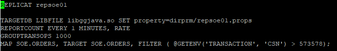

```
ggsci> add replicat repsoe01, exttrail ./dirdat/rt
```

# Configuração do Data Pump - origem

```bash
cd /u05/goldengate/ogg_1
./ggsci
```

```
ggsci> dblogin useridalias orcl001_ggadmin
```

* Criar o arquivo do extract Data Pump

  ```
  ggsci> edit params pmpsoe01
  ```

* No arquivo, informar os dados abaixo:

  ```
  extract pmpsoe01

  rmthost 127.0.0.1, mgrport 27809
  rmttrail ./dirdat/rt

  reportcount every 10 minutes, rate
  reportrollover at 00:01
  report at 00:01
  statoptions resetreportstats

  table soe.orders;
  ```

* Fechar o vi

  ```
  ggsci> add extract pmpsoe01, exttrailsource ./dirdat/et
  ggsci> add rmttrail ./dirdat/rt, extract pmpsoe01
  ```

# Carga inicial e início da replicação

```bash
cd /u05/goldengate/ogg_1
./ggsci
```

* No source - GoldenGate for Oracle

  ```
  ggsci> ADD EXTRACT ilesoe01, SOURCEISTABLE
  ggsci> edit params ilesoe01
  ```

* No arquivo aberto, informar os dados abaixo:

  ```
  EXTRACT ilesoe01
  USERIDALIAS orcl001_ggadmin
  rmthost 127.0.0.1, mgrport 27809

  RMTTASK REPLICAT, GROUP ilrsoe01
  TABLE soe.orders, sqlpredicate "as of scn <<SCN OBTIDO NO PASSO [20](#obter-scn-da-base)>>";
  ```

* Fechar o vi

  

* No target - GoldenGate for Big Data

  ```bash
  cd /u05/goldengate/oggbigdata_1
  ./ggsci
  ```

  ```
  ggsci> add replicat ilrsoe01, specialrun
  ggsci> edit params ilrsoe01
  ```

* No arquivo aberto, informar os dados abaixo:

  ```
  REPLICAT ilrsoe01
  TARGETDB LIBFILE libggjava.so SET property=dirprm/repsoe01.props
  REPORTCOUNT EVERY 1 MINUTES, RATE
  GROUPTRANSOPS 1000
  MAP SOE.orders, TARGET SOE.orders;
  ```

* Fechar o vi

* No source - GoldenGate for Oracle

  ```bash
  cd /u05/goldengate/ogg_1
  ./ggsci
  ```

  ```
  ggsci> start extract extsoe01
  ggsci> start extract ilesoe01
  ```

* No target - GoldenGate for Big Data

* Repetir o comando abaixo até o replicat ilrsoe terminar com sucesso

  ```bash
  cd /u05/goldengate/oggbigdata_1
  ./ggsci
  ```

  ```
  ggsci> view report ilrsoe01
  ```

* Só avançar para este passo após garantir que a carga inicial foi concluída com sucesso.

  ```
  ggsci> start replicat repsoe01
  ```

* Na origem - GoldenGate for Oracle

  ```bash
  cd /u05/goldengate/ogg_1
  ./ggsci
  ```

  ```
  ggsci> start extract pmpsoe01
  ```

* No destino, verificar checkpoint do replicat

  ```bash
  cd /u05/goldengate/oggbigdata_1
  ./ggsci
  ```

  ```
  ggsci> info replicat repsoe01, showch
  ```

* Caso o replicat já tenha passado pelo SCN usado no replicat de inicial load, remover filtro de SCN do replicat normal

  ```
  ggsci> edit params repsoe01
  ```

  ```
  REPLICAT repsoe01

  TARGETDB LIBFILE libggjava.so SET property=dirprm/repsoe01.props
  REPORTCOUNT EVERY 1 MINUTES, RATE
  GROUPTRANSOPS 1000
  MAP SOE.ORDERS, TARGET SOE.ORDERS;
  ```

* Fechar o vi

* Reiniciar o replicat

  ```
  ggsci> stop repsoe01
  ggsci> info repsoe01
  ggsci> start repsoe01
  ```

# Verificar status dos uploads

* Pelo Hadoop client

  ```bash
  /u05/goldengate/hadoop/hadoop-3.2.1/bin/hadoop fs -ls /
  ```

  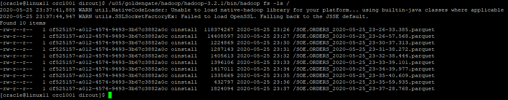

* Pelo Portal da Azure

  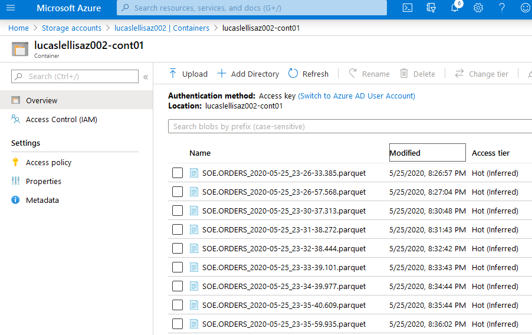

# Referências {.unnumbered}

* [ALO OGG Extract Unable to Find Archive Logs Under Date Coded sub Directories (Doc ID 1359776.1)](https://support.oracle.com/epmos/faces/DocContentDisplay?id=1359776.1)
* [Can Oracle GoldenGate be Used to Replicate SAP Data ? (Doc ID 1269452.1)](https://support.oracle.com/epmos/faces/DocContentDisplay?id=1269452.1)
* [FAQ for Oracle GoldenGate Extract in ALO mode on Oracle Database. (Doc ID 1433357.1)](https://support.oracle.com/epmos/faces/DocContentDisplay?id=1433357.1)
* [GG Java Adaptor - REPLICAT Not Starting on AIX (Doc ID 2198416.1)](https://support.oracle.com/epmos/faces/DocContentDisplay?id=2198416.1)
* [GoldenGate 12.2 new parameter ALLOWOUTPUTDIR](https://blog.dbi-services.com/goldengate-12-2-new-parameter-allowoutputdir/)
* [Goldengate : Direct Load - Initial Load Techniques (Doc ID 1457164.1)](https://support.oracle.com/epmos/faces/DocContentDisplay?id=1457164.1)
* [GoldenGate Extract Archived Log Only (ALO) Mode Template Best Practices (Doc ID 1482439.1)](https://support.oracle.com/epmos/faces/DocContentDisplay?id=1482439.1)
* [Goldengate Not Capturing Key Column Values Although Supplemental Log Data And Trandata Is Enabled (For SAP Database) (Doc ID 2304084.1)](https://support.oracle.com/epmos/faces/DocContentDisplay?id=2304084.1)
* [How to add tables to an Existing GoldenGate Configuration with Transaction Integrity? (Doc ID 1607591.1)](https://support.oracle.com/epmos/faces/DocContentDisplay?id=1607591.1)
* [How to confirm current configuration mode for Extract/Replicat (Doc ID 2187970.1)](https://support.oracle.com/epmos/faces/DocContentDisplay?id=2187970.1)
* [How to procure Tenant ID, Client ID and Client Secret key to connect to Microsoft Azure Data Lake Storage Gen2](https://developer.ibm.com/recipes/tutorials/how-to-procure-tenant-id-client-id-and-client-secret-key-to-connect-to-microsoft-azure-data-lake-storage-gen2/)
* [Main Note - Oracle GoldenGate - Installation (Doc ID 1304564.1)](https://support.oracle.com/epmos/faces/DocContentDisplay?id=1304564.1)
* [Master Note - Oracle GoldenGate: Initial Load Techniques and References (Doc ID 1311707.1)](https://support.oracle.com/epmos/faces/DocContentDisplay?id=1311707.1)
* [Master Note for Oracle GoldenGate for Filtering and Transformation Data (Doc ID 1450495.1)](https://support.oracle.com/epmos/faces/DocContentDisplay?id=1450495.1)
* [OGG How to Resync Tables / Schemas on Different SCN s in a Single Replicat (Doc ID 1339317.1)](https://support.oracle.com/epmos/faces/DocContentDisplay?id=1339317.1)
* [OGG v12.1.x OUI Install Without Graphic Environment (Doc ID 1608893.1)](https://support.oracle.com/epmos/faces/DocContentDisplay?id=1608893.1)
* [Oracle GoldenGate Best Practices: Configuring Oracle GoldenGate with Oracle Grid Infrastructure Bundled Agents (XAG) (Doc ID 1527310.1)](https://support.oracle.com/epmos/faces/DocContentDisplay?id=1527310.1)
* [Oracle GoldenGate Best Practices: Instantiation from an Oracle Source Database (Doc ID 1276058.1)](https://support.oracle.com/epmos/faces/DocContentDisplay?id=1527310.1)
* [Oracle GoldenGate Best Practices: Replication between Cloud and On-Premise Environments with Oracle GoldenGate (Doc ID 1996653.1)](https://support.oracle.com/epmos/faces/DocContentDisplay?id=1996653.1)
* [Oracle GoldenGate Best Practices: sample parameter files (Doc ID 1321696.1)](https://support.oracle.com/epmos/faces/DocContentDisplay?id=1321696.1)
* [Step by Step Installation of 12.2 GoldenGate Replicat for HDFS example (Doc ID 2241503.1)](https://support.oracle.com/epmos/faces/DocContentDisplay?id=2241503.1)
* [Why OGG Warns me "No unique key is defined" When There Is A PK For The Table (Doc ID 1345152.1)](https://support.oracle.com/epmos/faces/DocContentDisplay?id=1345152.1)
